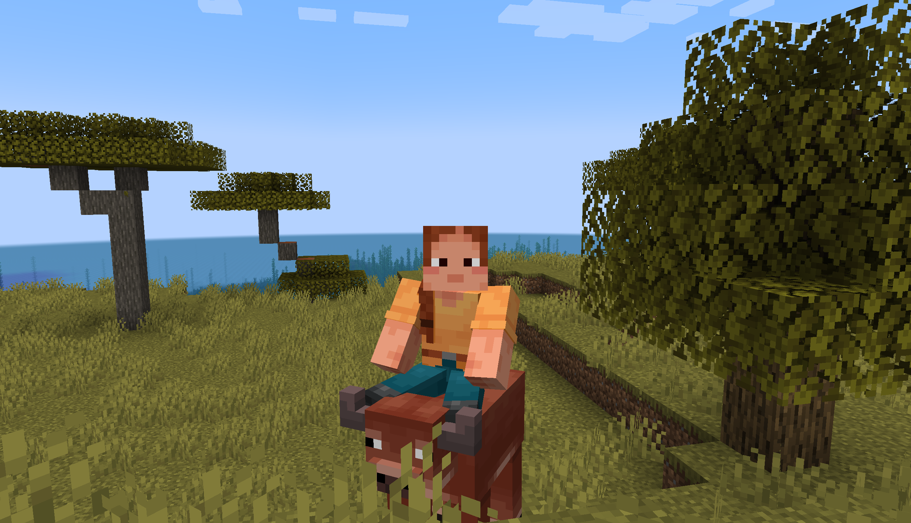

# RideAnything

Ride any animal in the game!



## The Code
This mod's entire functionality is in 5 lines of code:
```java
if (entity instanceof AnimalEntity && 
player.getMainHandStack().isEmpty()) {
		if (player.startRiding(entity)) {
			return ActionResult.SUCCESS;
		}
}
```
That's it!

Any mob in Minecraft that is an `AnimalEntity` can now be ridden by right clicking with an empty hand.

This includes basically every animal in the game, including some hostile ones, like hoglins. Good luck!