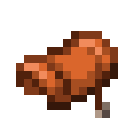

#  Ride Anything
*Requires [YACL](https://modrinth.com/mod/yacl) and [Mod Menu](https://modrinth.com/mod/modmenu) for configuration.*

**Ride any mob in the game!**

This mod allows you to configure what types of mobs can be ridden in Minecraft. There are three modes:
* **Only Animals** - Only entities that extend AnimalEntity, list shown below.
* **All** - All living entities.
* **Custom** - Custom entities defined in a list

The default mode is **Only Animals**.

  
List of animal entities

  *Italicized if already rideable in vanilla*
  - Armadillo  
  - Axolotl  
  - Bee  
  - *Camel* 
  - Cat  
  - Chicken  
  - Cow  
  - *Donkey*  
  - Fox  
  - Frog  
  - Goat  
  - *Happy Ghast*    
  - Hoglin  
  - *Llama*    
  - Mooshroom   
  - *Mule*  
  - Ocelot  
  - Panda   
  - Parrot  
  - Pig  
  - Polar Bear  
  - Rabbit  
  - Sheep  
  - *Skeleton Horse*  
  - Sniffer  
  - *Strider*   
  - *Trader Llama*   
  - Turtle  
  - Wolf  
  - Zombie Horse  

  

The config screen can be opened from Mod Menu, and the config file can also be directly edited.